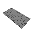

# Lego Case for Arduino

## Design Goals

* Case should fit snug without any movement
* Lego bricks should not touch the bottom of the circuit board
* Use common Lego bricks

## Insights

* The grooves of Lego Radiator Grille can suspend circuit board
* Only need to suspend circuit board in three places

## Bricks

| Brick   | Name                          | Picture                             | Part  | Color code              | Quantity |
|---------|-------------------------------|------------------------------------ |-------|-------------------------|----------|
| 300401  | BRICK 1X2                     |  | 3004  | 1 - White               | 1        |
| 362201  | BRICK 1X3                     |   | 3622  | 1 - White               | 1        |
| 4251160 | BRICK 1X3                     |  | 3622  | 140 - Earth Blue        | 3        |
| 300301  | BRICK 2X2                     |   | 3003  | 1 - White               | 2        |
| 301001  | BRICK 1X4                     |   | 3010  | 1 - White               | 2        |
| 301023  | BRICK 1X4                     |   | 3010  | 23 - Bright Blue        | 3        |
| 300101  | BRICK 2X4                     |   | 3001  | 1 - White               | 1        |
| 4264581 | BRICK 2X4                     |   | 3001  | 140 - Earth Blue        | 2        |
| 300123  | BRICK 2X4                     |   | 3001  | 23 - Bright Blue        | 3        |
| 6058177 | BRICK 1X2 W. 2 KNOBS          |  | 11211 | 1 - White               | 1        |
| 4143254 | BRICK 1X4 W. 4 KNOBS          |  | 30414 | 1 - White               | 1        |
| 241221  | RADIATOR GRILLE 1X2           |  | 2412  | 21 - Bright Red         | 3        |
| 302301  | PLATE 1X2                     |  | 3023  | 1 - White               | 1        |
| 302323  | PLATE 1X2                     |  | 3023  | 23 - Bright Blue        | 1        |
| 4560180 | FLAT TILE 2X4                 |   | 87079 | 23 - Bright Blue        | 2        |
| 4211401 | PLATE 4X12                    |   | 3029  | 194 - Medium Stone Grey | 1        |
| 4210657 | PLATE 6X12                    |  | 3028  | 199 - Dark Stone Grey   | 1        |
| 6018774 | ANGULAR PLATE 1,5 TOP 1X2 1/2 |  | 99781 | 1 - White               | 1        |

## Instructions

* Available as [LXF](arduino_case.lxf)
* HTML [instructions](instructions/index.html) generated by Lego Digital Designer.

## Tested hardware

* [DFRduino Duemilanove](images/dfrduino_duemilanove.png)

## Notes

I used different colors for demonstration purposes only.  Please feel free to experiment with your design.
